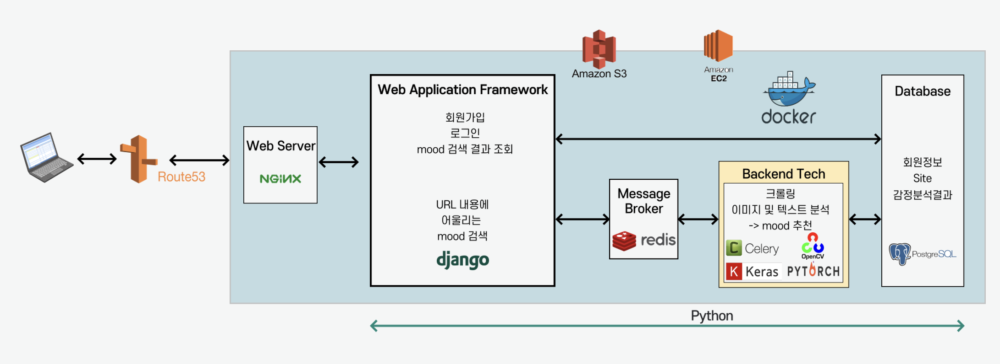
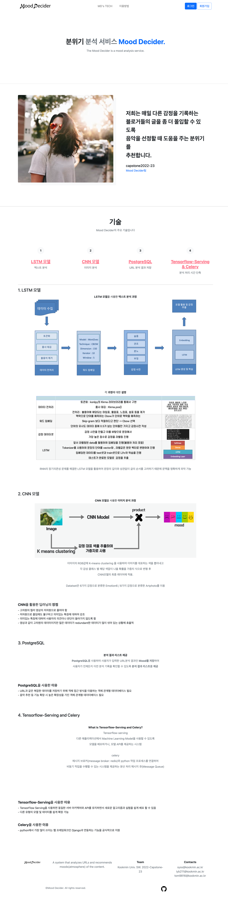

[](https://classroom.github.com/online_ide?assignment_repo_id=7010563&assignment_repo_type=AssignmentRepo)

**팀페이지 주소** -> https://github.com/kookmin-sw/capstone-2022-23

# Mood Decider
## Index
- [프로젝트 소개](#1-프로젝트-소개)
  - [👉🏻 개발배경](#👉🏻-개발배경)
  - [👉🏻 시스템구조도](#👉🏻-시스템구조도)
  - [👉🏻 UI구현화면](#👉🏻-ui구현화면)
- [소개 영상](#2-소개-영상)
  - [2-1. 중간 발표 소개 영상](#2-1-중간-발표-소개-영상)
  - [2-2. 시연 영상](#2-2-시연-영상)
- [팀 소개](#3-팀-소개)
- [프로젝트 사용법](#4-사용법)
- [산출물](#5-산출물)

---
## 1. 프로젝트 소개

#### 👉🏻 개발배경

<p>
<span>
  웹툰, 웹소설과 같은 컨텐츠 사업의 규모가 꾸준하게
커지고 있습니다(20년 기준 웹소설 6000억원, 웹툰 1조원 이상).

  규모가 커짐에 따라 단순히 그림과 글만이 아닌 배경음악을
넣어 독자가 작품에 더욱 몰입할 수 있도록 창작자들은 청각적 요소까지 고려합니다.

  매주 같은 시간 내에 창작물을 만들어야하는 창작자들에게
작품에 어울리는 분위기를 찾아주어 한정된 시간을 효율적으로 사용할 수 있도록 도와주는 프로젝트인 Mood Decider를 개발하고자 합니다.

  또한 Mood Decider는 특정 창작자뿐만 아니라 감정을 적고
일상을 적어 공유하는 블로거들에게도 글과 이미지를 분석하여 분위기를 알려줌으로써 블로그의 방향성 및 배경음악 선택 등의 도움을 줄 수 있을 것이라 생각합니다.
</span>
</p>

#### 👉🏻 시스템구조도



#### 👉🏻 UI구현화면





## 2. 소개 영상

### 2-1. 중간 발표 소개 영상
[](https://www.youtube.com/watch?v=DZUP4tkgEfk)

### 2-2. 시연 영상
[](https://youtu.be/CnEgGZ-wjtc)


## 3. 팀 소개


```
🧑🏻‍💻 Name: 정태원
🌱 StudentID: ****1703
📧 Email: tom9816@kookmin.ac.kr
🔥 Role
    👉🏻 팀장(인적자원관리)
    👉🏻 AI(텍스트 분석 파트)
    👉🏻 데이터 셋 구축 및 모델 학습
    👉🏻 AWS EC2, AWS S3 설정


```

<br/>   


```
👨🏻‍💻 Name: 임용빈
🌱 StudentID: ****1687
📧 Email: iyb211@kookmin.ac.kr
🔥 Role
    👉🏻 AI(이미지 분석 파트)
    👉🏻 데이터 셋 구축 및 모델 학습
    👉🏻 모델 성능 향상
    👉🏻 AWS EC2, AWS S3 설정


```


```
👩🏻‍💻 Name: 오수연
🌱 StudentID: ****5287
📧 Email: syss@kookmin.ac.kr
🔥 Role
    👉🏻 Frontend
    👉🏻 Backend
    👉🏻 UI/UX 설계
    👉🏻 AWS EC2, AWS S3 설정


```

## 4. 사용법
```
1)	http://mooddecider.com에 접속합니다.
2)	회원가입
    A.	상단의 회원가입 버튼 혹은 이용 방법 페이지에 있는 회원가입 바로하기 버튼을 클릭하여 회원가입 페이지로 이동합니다.
    B.	사용하고자 하는 유저네임(Username), 이름(Name), 이메일(Email), 비밀번호(Password)를 입력합니다. 이 때, 유저네임과 이메일은 이전에 등록되지 않은 값이어야 합니다.
    C.	가입 완료 버튼을 누르기 전, 이용목적인 Purpose를 꼭 알맞게 선택해주세요.
    D.	회원 가입을 완료합니다.
3)	로그인
    A.	상단의 로그인 버튼 혹은 이용 방법 페이지에 있는 로그인 바로하기 버튼을 클릭하여 로그인 페이지로 이동합니다.
    B.	이전에 회원가입 시, 생성하였던 유저네임(Username)과 비밀번호(Password)를 입력합니다.
    C.	로그인을 완료합니다.
4)	Mood 검색
    A.	상단의 Mood 검색 혹은 이용 방법 페이지에 있는 Mood 분석 바로가기 버튼을 클릭하여 Mood 분석 페이지로 이동합니다.
    B.	분석을 원하는 URL을 복사하거나 타이핑하여 안내된 형식에 맞게 입력란에 작성합니다.
    C.	URL을 정확하게 입력했다면, 분석하기 버튼을 클릭합니다.
    D.	‘잠시만 기다려주세요’라는 랜딩 이미지(landing image)가 사라질 때까지 조금 기다려줍니다.
    E.	랜딩 이미지(landing image)가 사라지고, 입력란이 다시 빈 칸이 되면, Mood검색을 완료한 것을 알 수 있습니다.
5)	Mood 분석 결과 조회
    A.	메뉴의 검색결과리스트 혹은 이용 방법 페이지에 있는 URL분석결과리스트 바로가기 버튼을 눌러 결과 조회 페이지로 이동합니다.
    B.	Mood 분석 결과 리스트가 바로 출력되어 URL에 해당하는 분위기를 조회할 수 있습니다.
```

## 5. 산출물
[중간발표자료](./docs/팀23-중간발표자료.pdf) 

[최종발표자료](./docs/팀23-최종발표자료.pdf)

[수행결과보고서](./docs/팀23-수행결과보고서.pdf)
