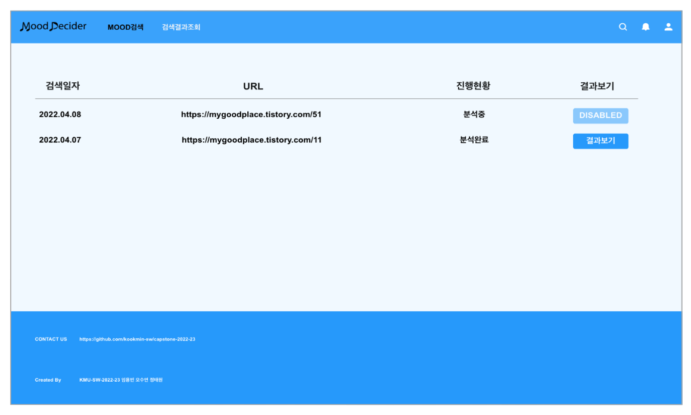
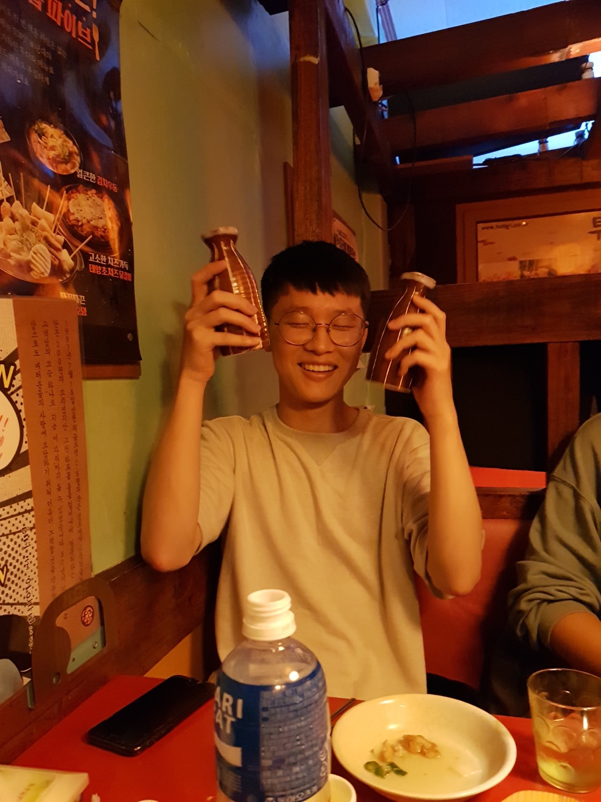

[](https://classroom.github.com/online_ide?assignment_repo_id=7010563&assignment_repo_type=AssignmentRepo)

**팀페이지 주소** -> https://github.com/kookmin-sw/capstone-2022-23

# Mood Decider

### 1. 프로젝트 소개

#### 👉🏻 개발배경

웹툰, 웹소설과 같은 컨텐츠 사업의 규모가 꾸준하게 커지고 있습니다(20년 기준 웹소설 6000억원, 웹툰 1조원 이상). 규모가 커짐에 따라 단순히 그림과 글만이 아닌 배경음악을 넣어 독자가 작품에 더욱 몰입할 수 있도록 창작자들은 청각적 요소까지 고려합니다.

매주 같은 시간 내에 창작물을 만들어야하는 창작자들에게 작품에 어울리는 분위기를 찾아주어 한정된 시간을 효율적으로 사용할 수 있도록 도와주는 프로젝트인 Mood Decider를 개발하고자 합니다.

또한 Mood Decider는 특정 창작자뿐만 아니라 감정을 적고 일상을 적어 공유하는 블로거들에게도 글과 이미지를 분석하여 분위기를 알려줌으로써 블로그의 방향성 및 배경음악 선택 등의 도움을 줄 수 있을 것이라 생각합니다.

#### 👉🏻 UI설계화면




### 2. 소개 영상

추후 작성 예정입니다.

### 3. 팀 소개


```
🧑🏻‍💻 Name: 정태원
🌱 StudentID: ****1703
📧 Email: tom9816@kookmin.ac.kr
🔥 Role
    👉🏻 팀장(인적자원관리)
    👉🏻 AI(텍스트 분석 파트)
    👉🏻 Backend
    👉🏻 데이터 셋 구축 및 모델 학습
    
    
    
```
   


```
👨🏻‍💻 Name: 임용빈
🌱 StudentID: ****1687
📧 Email: iyb211@kookmin.ac.kr
🔥 Role
    👉🏻 AI(이미지 분석 파트)
    👉🏻 Backend
    👉🏻 데이터 셋 구축 및 모델 학습
    👉🏻 모델 성능 향상
    
    
    
```


```
👩🏻‍💻 Name: 오수연
🌱 StudentID: ****5287
📧 Email: syss@kookmin.ac.kr
🔥 Role
    👉🏻 Frontend
    👉🏻 Backend
    👉🏻 UI/UX 설계
    👉🏻 프로젝트 문서 관리
    
    
    
```

</br>

### 4. 사용법

추후 작성 예정입니다.

### 5. 기타

추후 작성 예정입니다.
